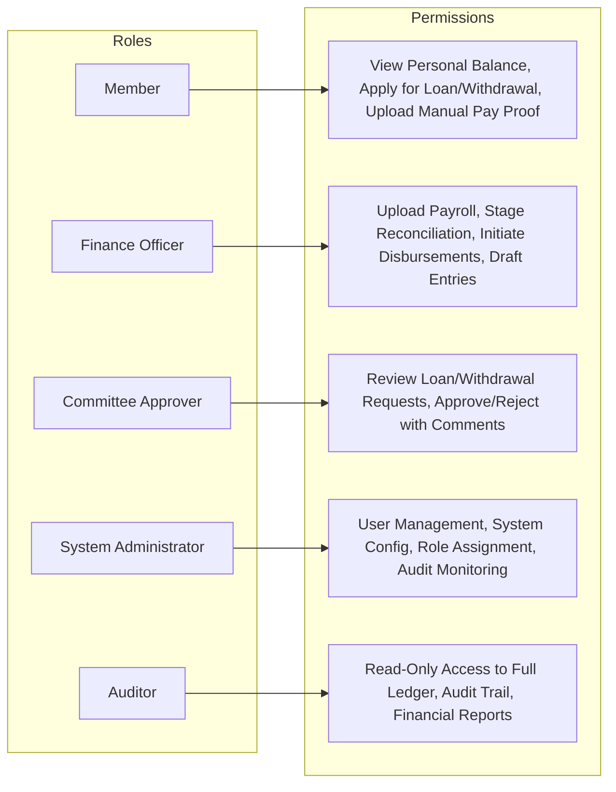
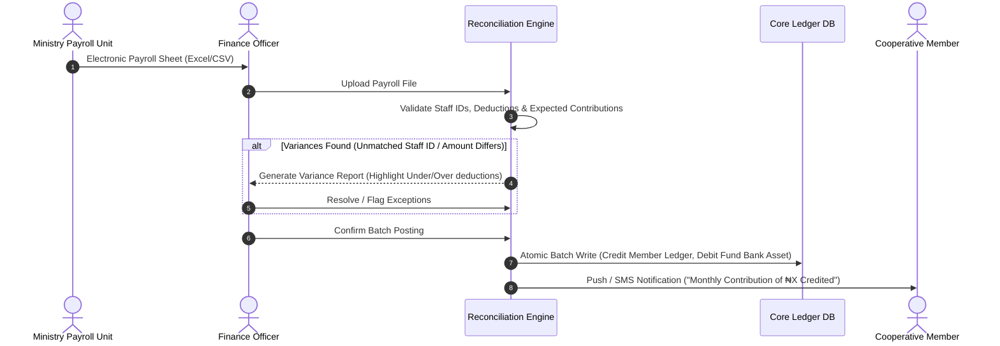
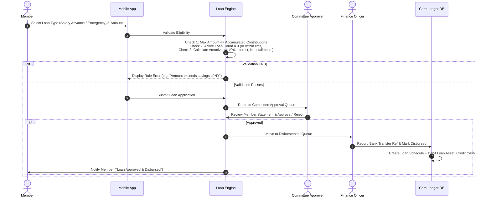
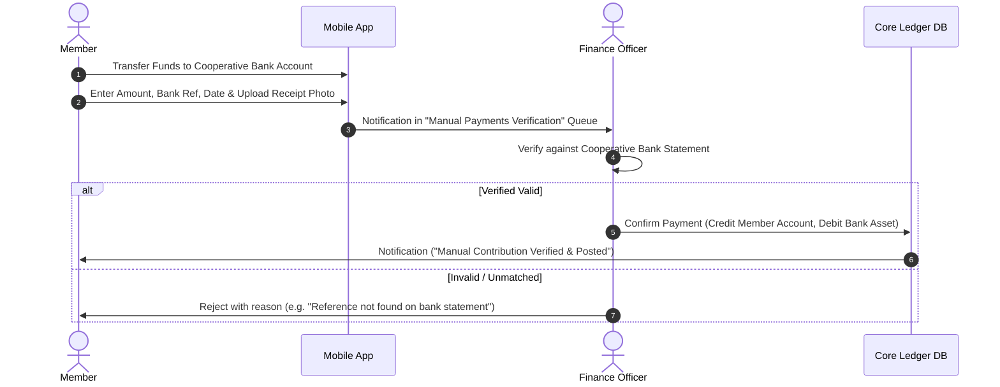
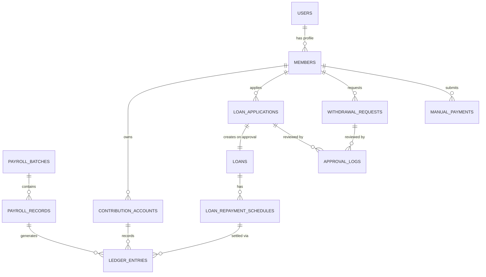
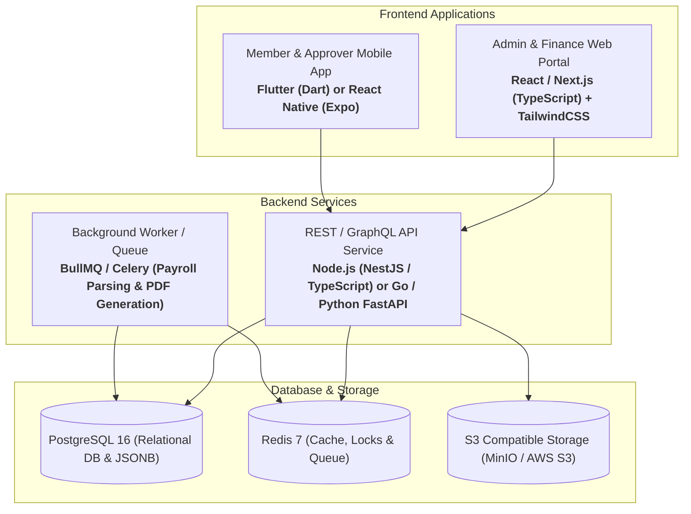

# Ministry Cooperative Contributory Fund Management System
## Comprehensive Product Architecture & System Design Document

---

## 1. Executive Summary & Product Architecture

The **Ministry Cooperative Contributory Fund Management System** is a secure, cloud-ready financial management platform designed to replace legacy manual spreadsheet processes for a government ministry cooperative society (serving 100–1,000 members). 

The platform provides a strict double-entry ledger core, role-based workflows, automated payroll reconciliation, interest-free loan servicing, committee approval governance, and cross-platform access via a Web Administrative Portal and Mobile Apps (Android & iOS).

### High-Level System Architecture Diagram

```mermaid
graph TB
    subgraph Client Layer
        M_APP["Mobile App (Android & iOS)<br/>Flutter / React Native<br/>(Members & Committee)"]
        W_PORTAL["Web Admin Dashboard<br/>React / Next.js<br/>(Finance, Admin, Committee, Auditor)"]
    end

    subgraph API Gateway & Security Layer
        GW["API Gateway / Reverse Proxy (Nginx / Cloudflare)"]
        AUTH["Auth & Identity Service (JWT + RBAC + 2FA / WebAuthn)"]
        RATE["Rate Limiting & WAF"]
    end

    subgraph Application & Business Logic Layer
        MEM_SVC["Member Management Module"]
        CONTR_SVC["Contribution & Ledger Module"]
        RECON_SVC["Payroll Ingestion & Reconciliation Engine"]
        LOAN_SVC["Loan Management Module (Advance / Emergency)"]
        WITH_SVC["Withdrawal & Exit Module"]
        APPRV_SVC["Committee Approval Workflow Engine"]
        REP_SVC["Financial Reporting & Audit Engine"]
        NOTIF_SVC["Notification Service (Push / SMS / Email)"]
    end

    subgraph Persistence & Storage Layer
        DB[(PostgreSQL Primary<br/>ACID Compliant Double-Entry Ledger)]
        REDIS[(Redis Cache / Job Queue)]
        DOCS[(Encrypted Object Store<br/>S3 / MinIO for Receipts & Payroll Files)]
    end

    Client Layer --> GW
    GW --> AUTH
    GW --> RATE
    RATE --> MEM_SVC & CONTR_SVC & RECON_SVC & LOAN_SVC & WITH_SVC & APPRV_SVC & REP_SVC
    
    MEM_SVC & CONTR_SVC & RECON_SVC & LOAN_SVC & WITH_SVC & APPRV_SVC & REP_SVC --> DB
    CONTR_SVC & RECON_SVC & LOAN_SVC --> REDIS
    RECON_SVC & NOTIF_SVC --> DOCS
```

---

## 2. Major Modules

The system is decomposed into 8 core business modules:

| Module | Core Purpose & Capabilities |
| :--- | :--- |
| **1. Member Identity & Profile Management** | Member registration, staff ID verification, ministry grade level, department, next-of-kin, payout bank details, biometric/PIN auth for mobile. |
| **2. Contribution & Individual Ledger** | Real-time calculation of member accumulated savings, contribution tier configurations (by grade or custom amount), manual contribution logging with proof-of-payment upload. |
| **3. Payroll Ingestion & Reconciliation Engine** | Electronic payroll file parser (Excel/CSV), Staff ID / IPPIS matching, variance detection (under-deductions, missing members), batch staging, and 1-click ledger posting. |
| **4. Loan Management (Salary Advance & Emergency)** | Application origination, validation against accumulated savings limit ($\le \text{Total Contributions}$), 0% interest calculation, monthly amortization scheduling, and balance tracking. |
| **5. Withdrawal & Member Exit Module** | Partial withdrawal requests, full membership liquidation/exit settlement, clearance checks (net of outstanding loans), and committee review. |
| **6. Committee Multi-Sign Approval Engine** | Multi-tier and quorum-based approval workflows for loans, withdrawals, and ledger adjustments. Digital signatures, approval timestamps, and rejection comments. |
| **7. General Ledger & Fund Accounting** | Strict double-entry accounting (Debits = Credits), bank cash book reconciliation, fund liquidity monitoring, and operational expense tracking. |
| **8. Reporting, Analytics & Audit Module** | Member statements, monthly contribution schedules, loan portfolio aging/performance, payroll variance reports, and immutable audit logs. |

---

## 3. User Roles & Access Control Matrix (RBAC)

To maintain absolute financial integrity and segregation of duties, the system enforces 5 distinct roles:



### Granular Role Permissions Matrix

| Feature / Action | Member (Employee) | Finance Officer | Committee Approver | System Admin | Internal Auditor |
| :--- | :---: | :---: | :---: | :---: | :---: |
| View Personal Savings & Loan Balance | ✅ (Self only) | ✅ (All) | ✅ (All) | ❌ | ✅ (All) |
| Apply for Loan / Withdrawal | ✅ | ❌ | ❌ | ❌ | ❌ |
| Make Manual Contribution (Proof Upload) | ✅ | ❌ | ❌ | ❌ | ❌ |
| Upload & Parse Electronic Payroll File | ❌ | ✅ | ❌ | ❌ | ❌ |
| Confirm & Post Payroll Reconciliation | ❌ | ✅ | ❌ | ❌ | ❌ |
| Approve / Reject Loans & Withdrawals | ❌ | ❌ | ✅ | ❌ | ❌ |
| Mark Approved Loans as Disbursed | ❌ | ✅ | ❌ | ❌ | ❌ |
| Generate Fund-wide Financial Statements | ❌ | ✅ | ✅ | ❌ | ✅ |
| Manage User Accounts & System Parameters | ❌ | ❌ | ❌ | ✅ | ❌ |
| View Immutable System Audit Logs | ❌ | ❌ | ❌ | ✅ | ✅ |

---

## 4. Main Business Workflows

### 4.1. Monthly Payroll Contribution & Reconciliation Workflow



### 4.2. Loan Origination, Validation & Multi-tier Approval Workflow



### 4.3. Manual Missed-Contribution Settlement Workflow



---

## 5. Core Entities & Data Architecture



---

## 6. Required Database Tables & Schema (PostgreSQL DDL Specifications)

### 6.1. Identity & Member Profiles
* `users`: Authentication credentials, email, phone, role (`MEMBER`, `FINANCE_OFFICER`, `COMMITTEE`, `ADMIN`, `AUDITOR`), 2FA secret, status (`ACTIVE`, `SUSPENDED`).
* `members`: `user_id`, `staff_id` (Ministry Employee ID/IPPIS), `first_name`, `last_name`, `grade_level`, `step`, `ministry_department`, `monthly_contribution_setting`, `bank_name`, `bank_account_number`, `bvn`, `next_of_kin_name`, `next_of_kin_phone`, `enrollment_date`.

### 6.2. Double-Entry Accounting & Ledger Core
* `accounts`: Chart of Accounts (`ASSET`, `LIABILITY`, `EQUITY`, `REVENUE`, `EXPENSE`).
  - *1010*: Cooperative Bank Account (Asset)
  - *1020*: Member Loans Receivable (Asset)
  - *2010*: Member Accumulated Savings (Liability)
  - *3010*: General Reserve Fund (Equity)
* `journal_entries`: `entry_id`, `transaction_date`, `reference_type` (`PAYROLL`, `LOAN_DISBURSEMENT`, `LOAN_REPAYMENT`, `WITHDRAWAL`, `MANUAL_PAYMENT`), `reference_id`, `description`, `created_by`, `posted_at`.
* `ledger_entries`: `id`, `journal_entry_id`, `account_id`, `member_id` (optional for general fund), `debit_amount`, `credit_amount`, `running_balance`.

### 6.3. Payroll Ingestion & Reconciliation
* `payroll_batches`: `id`, `payroll_month` (e.g. `2026-08`), `total_records`, `total_amount_deducted`, `matched_count`, `variance_count`, `file_url`, `status` (`STAGED`, `RECONCILED`, `POSTED`, `CANCELLED`), `uploaded_by`, `posted_at`.
* `payroll_records`: `id`, `batch_id`, `staff_id`, `raw_name`, `amount_deducted`, `savings_portion`, `loan_repayment_portion`, `match_status` (`MATCHED`, `UNMATCHED_STAFF_ID`, `AMOUNT_MISMATCH`), `resolution_note`.

### 6.4. Loan Management (0% Interest)
* `loan_applications`: `id`, `member_id`, `loan_type` (`SALARY_ADVANCE`, `EMERGENCY`), `requested_amount`, `tenor_months`, `purpose`, `status` (`SUBMITTED`, `COMMITTEE_REVIEW`, `APPROVED`, `REJECTED`, `DISBURSED`, `CANCELLED`), `rejection_reason`.
* `loans`: `id`, `application_id`, `member_id`, `principal_amount`, `interest_rate` (default `0.00`), `monthly_installment`, `tenor_months`, `outstanding_balance`, `disbursement_date`, `disbursement_ref`, `status` (`ACTIVE`, `PAID_OFF`, `DEFAULTED`).
* `loan_repayment_schedules`: `id`, `loan_id`, `installment_number`, `due_date`, `expected_amount`, `paid_amount`, `status` (`PENDING`, `PAID`, `PARTIAL`, `MISSED`), `settled_at`, `ledger_entry_id`.

### 6.5. Withdrawals, Approvals & Audit
* `withdrawal_requests`: `id`, `member_id`, `withdrawal_type` (`PARTIAL`, `FULL_EXIT`), `requested_amount`, `outstanding_loan_deduction`, `net_payout_amount`, `reason`, `status` (`PENDING`, `APPROVED`, `REJECTED`, `PAID`).
* `approval_logs`: `id`, `entity_type` (`LOAN`, `WITHDRAWAL`), `entity_id`, `approver_id`, `action` (`APPROVE`, `REJECT`), `comments`, `created_at`.
* `manual_payments`: `id`, `member_id`, `target_type` (`CONTRIBUTION`, `LOAN_REPAYMENT`), `target_loan_id`, `amount`, `payment_date`, `bank_reference`, `proof_of_payment_url`, `status` (`PENDING_VERIFICATION`, `VERIFIED`, `REJECTED`), `verified_by`, `verified_at`.
* `audit_logs`: `id`, `user_id`, `action`, `resource`, `resource_id`, `ip_address`, `user_agent`, `old_values` (JSONB), `new_values` (JSONB), `created_at`.

---

## 7. Security, Compliance & Data Protection Requirements

1. **Double-Entry Integrity & Immutability**: All financial transactions must use immutable double-entry journal records. No direct updates or deletions on balance columns; running balances are derived or transactionally committed via row-level locks (`SELECT ... FOR UPDATE`).
2. **Strict Financial Constraint Checks**:
   - $\text{Max Loan Amount} \le \text{Accumulated Member Savings}$
   - $\text{Net Withdrawal} = \text{Requested Amount} - \text{Active Loan Balance}$
3. **Role-Based Access Control (RBAC)**: Enforce least-privilege principles across web API endpoints and mobile gateways.
4. **Audit Trail & Traceability**: All financial mutations, batch reconciliations, and committee decisions record actor ID, IP address, timestamp, and before/after state diff.
5. **Data Encryption**:
   - In-Transit: TLS 1.3 for all web and mobile traffic.
   - At-Rest: AES-256 for database volumes and S3 storage.
   - Sensitive Fields: Encryption for BVN, account numbers, and personal identifiers.
6. **Authentication & Session Security**: JWT with short expiration + secure HTTP-only refresh tokens, biometric login on mobile (FaceID/Fingerprint), and Multi-Factor Authentication (MFA) for Finance and Committee roles.

---

## 8. Recommended Technology Architecture



* **Frontend (Web Dashboard)**: Next.js / React with TypeScript, TailwindCSS (Clean, high-density financial UI, Excel-like data grid components).
* **Mobile Applications**: Flutter or React Native for single-codebase native performance on Android and iOS.
* **Backend API**: NestJS (TypeScript) or Go (Golang) / FastAPI — strict typing, modular dependency injection, and high throughput for financial batch processing.
* **Database**: PostgreSQL 16 with ACID transactional integrity, advisory locks for financial safety, and JSONB audit logs.
* **Background Jobs & Cache**: Redis + BullMQ for async payroll parsing, PDF statement generation, and push notification dispatch.
* **File Storage**: Encrypted S3-compatible bucket (MinIO / Cloudflare R2 / AWS S3) for payment receipts and payroll upload files.

---

## 9. Implementation Scope Breakdown

### Phase 1: MVP Scope (Core Operations)
- [x] Member registration, authentication, and personal profile management.
- [x] Excel/CSV electronic payroll file ingestion with automated Staff ID reconciliation and batch ledger posting.
- [x] Individual member contribution ledger and balance calculator.
- [x] Salary Advance and Emergency Loan origination with interest-free ($0\%$) amortization scheduling.
- [x] Rule engine enforcing $\text{Loan} \le \text{Accumulated Savings}$.
- [x] Committee Approval Portal (Review, Approve, Reject with comments).
- [x] Manual missed-payment submission and verification workflow.
- [x] Member financial statement (PDF download) and transaction history.
- [x] Web Admin Dashboard + Cross-platform Mobile App baseline.

### Phase 2: Future Expansion Scope (Post-MVP)
- Automated direct bank API integration for instant disbursement upon committee approval (e.g. NIBSS / Paystack / Flutterwave).
- Integrated SMS / WhatsApp gateway for real-time transaction alerts.
- Annual dividend calculation and surplus redistribution engine.
- Target savings / special project sub-funds (e.g. Housing / Land purchase schemes).
- Advanced automated predictive delinquency and liquidity forecasting dashboard.
