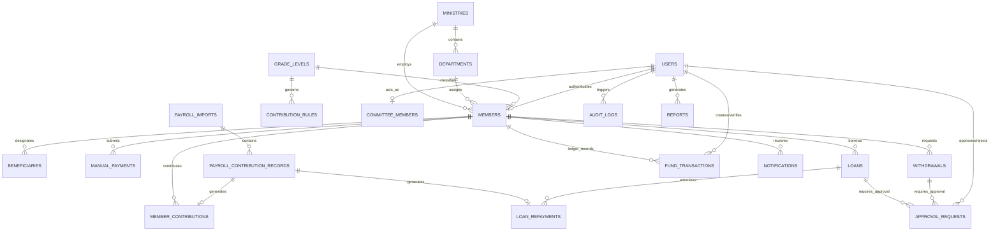

# Normalized Relational Database Specification
## Ministry Cooperative Contributory Fund Management Platform

---

## 1. Database Entity-Relationship (ER) Diagram



---

## 2. Table Specifications & Schema Architecture

The database is fully normalized to **Third Normal Form (3NF)** with strict referential integrity, foreign keys, check constraints, composite unique indexes, and audit immutability triggers.

---

### Group 1: Organizational Hierarchy & System Foundation

#### 1. `ministries`
Stores government ministry entities.
* `id` (UUID, PK)
* `code` (VARCHAR(50), UNIQUE, NOT NULL) — e.g. `MIN_EDU`, `MIN_FIN`
* `name` (VARCHAR(255), NOT NULL)
* `is_active` (BOOLEAN, DEFAULT TRUE)
* `created_at` (TIMESTAMPTZ, DEFAULT NOW())
* `updated_at` (TIMESTAMPTZ, DEFAULT NOW())

#### 2. `departments`
Departments within ministries.
* `id` (UUID, PK)
* `ministry_id` (UUID, FK -> `ministries.id`, NOT NULL)
* `code` (VARCHAR(50), NOT NULL)
* `name` (VARCHAR(255), NOT NULL)
* `created_at` (TIMESTAMPTZ, DEFAULT NOW())
* **Constraint**: `UNIQUE(ministry_id, code)`

#### 3. `grade_levels`
Civil service salary grade levels and steps.
* `id` (UUID, PK)
* `level_code` (VARCHAR(20), UNIQUE, NOT NULL) — e.g. `GL_08`, `GL_12`, `GL_16`
* `description` (VARCHAR(100))
* `basic_monthly_salary` (DECIMAL(15,2), NOT NULL)
* `created_at` (TIMESTAMPTZ, DEFAULT NOW())

#### 4. `contribution_rules`
Policy rules for monthly contribution minimums and brackets per grade level.
* `id` (UUID, PK)
* `grade_level_id` (UUID, FK -> `grade_levels.id`, NOT NULL)
* `minimum_contribution_amount` (DECIMAL(15,2), NOT NULL CHECK (minimum_contribution_amount > 0))
* `default_contribution_amount` (DECIMAL(15,2), NOT NULL)
* `max_loan_multiplier` (DECIMAL(4,2), DEFAULT 1.00) — Multiplier against savings (Cooperative rule: 1.00 = 100% of savings)
* `effective_from` (DATE, NOT NULL)
* `effective_to` (DATE)
* `is_active` (BOOLEAN, DEFAULT TRUE)
* `created_at` (TIMESTAMPTZ, DEFAULT NOW())

---

### Group 2: Identity, Membership & Beneficiaries

#### 5. `users`
System authentication and access control accounts.
* `id` (UUID, PK)
* `email` (VARCHAR(255), UNIQUE, NOT NULL)
* `phone_number` (VARCHAR(20), UNIQUE, NOT NULL)
* `password_hash` (VARCHAR(255), NOT NULL)
* `role` (VARCHAR(50), NOT NULL CHECK (role IN ('SUPER_ADMIN', 'FINANCE_OFFICER', 'APPROVING_OFFICER', 'MEMBER')))
* `is_active` (BOOLEAN, DEFAULT TRUE)
* `last_login_at` (TIMESTAMPTZ)
* `created_at` (TIMESTAMPTZ, DEFAULT NOW())
* `updated_at` (TIMESTAMPTZ, DEFAULT NOW())

#### 6. `members`
Comprehensive member profile and master financial summary.
* `id` (UUID, PK)
* `user_id` (UUID, FK -> `users.id`, UNIQUE, NULLABLE)
* `serial_number` (BIGSERIAL, UNIQUE, NOT NULL) — Auto-incrementing member sequential ID
* `member_number` (VARCHAR(50), UNIQUE, NOT NULL) — Human-readable format: `COOP-2026-0001`
* `employee_id` (VARCHAR(50), UNIQUE, NOT NULL) — Ministry Staff / IPPIS ID
* `first_name` (VARCHAR(100), NOT NULL)
* `last_name` (VARCHAR(100), NOT NULL)
* `full_name` (VARCHAR(255), GENERATED ALWAYS AS (first_name || ' ' || last_name) STORED)
* `ministry_id` (UUID, FK -> `ministries.id`, NOT NULL)
* `department_id` (UUID, FK -> `departments.id`, NOT NULL)
* `grade_level_id` (UUID, FK -> `grade_levels.id`, NOT NULL)
* `phone_number` (VARCHAR(20), NOT NULL)
* `date_joined` (DATE, NOT NULL)
* `monthly_contribution_amount` (DECIMAL(15,2), NOT NULL CHECK (monthly_contribution_amount > 0))
* `current_contribution_balance` (DECIMAL(15,2), DEFAULT 0.00 CHECK (current_contribution_balance >= 0))
* `current_loan_balance` (DECIMAL(15,2), DEFAULT 0.00 CHECK (current_loan_balance >= 0))
* `status` (VARCHAR(30), DEFAULT 'ACTIVE' CHECK (status IN ('ACTIVE', 'INACTIVE', 'SUSPENDED', 'EXITED')))
* `bank_name` (VARCHAR(100))
* `bank_account_number` (VARCHAR(20))
* `created_at` (TIMESTAMPTZ, DEFAULT NOW())
* `updated_at` (TIMESTAMPTZ, DEFAULT NOW())

#### 7. `beneficiaries`
Designated next-of-kin and beneficiary allocations.
* `id` (UUID, PK)
* `member_id` (UUID, FK -> `members.id` ON DELETE CASCADE, NOT NULL)
* `full_name` (VARCHAR(255), NOT NULL)
* `relationship` (VARCHAR(50), NOT NULL) — e.g. `SPOUSE`, `CHILD`, `PARENT`, `SIBLING`
* `phone_number` (VARCHAR(20), NOT NULL)
* `allocation_percentage` (DECIMAL(5,2), NOT NULL CHECK (allocation_percentage > 0 AND allocation_percentage <= 100))
* `is_primary` (BOOLEAN, DEFAULT FALSE)
* `created_at` (TIMESTAMPTZ, DEFAULT NOW())

#### 8. `committee_members`
Active approving authority members.
* `id` (UUID, PK)
* `user_id` (UUID, FK -> `users.id`, UNIQUE, NOT NULL)
* `member_id` (UUID, FK -> `members.id`, UNIQUE, NOT NULL)
* `designation` (VARCHAR(100), NOT NULL) — e.g. `CHAIRMAN`, `SECRETARY`, `TREASURER`, `COMMITTEE_MEMBER`
* `term_start_date` (DATE, NOT NULL)
* `term_end_date` (DATE)
* `is_active` (BOOLEAN, DEFAULT TRUE)

---

### Group 3: Core Financial Ledger & Transactions

#### 9. `fund_transactions` (The Immutable Core Ledger)
The authoritative financial transaction journal.
* `id` (UUID, PK)
* `transaction_number` (VARCHAR(60), UNIQUE, NOT NULL) — e.g. `TXN-202608-000001`
* `member_id` (UUID, FK -> `members.id`, NULLABLE for general reserve entries)
* `transaction_type` (VARCHAR(50), NOT NULL CHECK (transaction_type IN ('CONTRIBUTION', 'LOAN_DISBURSEMENT', 'LOAN_REPAYMENT', 'WITHDRAWAL_PAYOUT', 'MANUAL_PAYMENT_CREDIT', 'FEE_PAYMENT', 'ADJUSTMENT_ENTRY')))
* `entry_type` (VARCHAR(10), NOT NULL CHECK (entry_type IN ('CREDIT', 'DEBIT')))
* `amount` (DECIMAL(15,2), NOT NULL CHECK (amount > 0))
* `running_balance_after` (DECIMAL(15,2), NOT NULL)
* `transaction_date` (TIMESTAMPTZ, NOT NULL)
* `reference_number` (VARCHAR(100), NOT NULL)
* `source` (VARCHAR(50), NOT NULL CHECK (source IN ('PAYROLL_IMPORT', 'MANUAL_PAYMENT', 'LOAN_DISBURSEMENT', 'WITHDRAWAL_PROCESSOR', 'DIRECT_ADJUSTMENT')))
* `status` (VARCHAR(30), DEFAULT 'POSTED' CHECK (status IN ('POSTED', 'REVERSED', 'CANCELLED')))
* `created_by_user_id` (UUID, FK -> `users.id`, NOT NULL)
* `verified_by_user_id` (UUID, FK -> `users.id`)
* `description` (TEXT NOT NULL)
* `created_at` (TIMESTAMPTZ, DEFAULT NOW())

---

### Group 4: Contributions & Payroll Processing

#### 10. `member_contributions`
Individual monthly contribution records.
* `id` (UUID, PK)
* `member_id` (UUID, FK -> `members.id`, NOT NULL)
* `amount` (DECIMAL(15,2), NOT NULL CHECK (amount > 0))
* `contribution_month` (VARCHAR(7), NOT NULL) — Format `YYYY-MM` (e.g. `2026-08`)
* `payment_method` (VARCHAR(50), NOT NULL CHECK (payment_method IN ('PAYROLL_DEDUCTION', 'DIRECT_BANK_TRANSFER', 'CASH_DEPOSIT', 'SPECIAL_OVERRIDE')))
* `payroll_import_id` (UUID, FK -> `payroll_imports.id`, NULLABLE)
* `transaction_reference` (VARCHAR(100), UNIQUE, NOT NULL)
* `fund_transaction_id` (UUID, FK -> `fund_transactions.id`, UNIQUE, NULLABLE)
* `status` (VARCHAR(30), DEFAULT 'COMPLETED' CHECK (status IN ('PENDING', 'COMPLETED', 'REJECTED', 'REVERSED')))
* `contribution_date` (DATE, NOT NULL)
* `verification_status` (VARCHAR(30), DEFAULT 'VERIFIED' CHECK (verification_status IN ('UNVERIFIED', 'VERIFIED', 'FLAGGED')))
* `allow_duplicate_override` (BOOLEAN, DEFAULT FALSE)
* `override_reason` (TEXT)
* `created_by_user_id` (UUID, FK -> `users.id`, NOT NULL)
* `created_at` (TIMESTAMPTZ, DEFAULT NOW())
* **Constraint (Duplicate Prevention)**: 
  `CREATE UNIQUE INDEX idx_unique_member_month_contribution ON member_contributions(member_id, contribution_month) WHERE status != 'REVERSED' AND allow_duplicate_override = FALSE;`

#### 11. `payroll_imports`
Monthly electronic payroll file ingestion headers.
* `id` (UUID, PK)
* `batch_reference` (VARCHAR(100), UNIQUE, NOT NULL)
* `payroll_month` (VARCHAR(7), NOT NULL) — Format `YYYY-MM`
* `total_records` (INT NOT NULL)
* `total_amount_deducted` (DECIMAL(15,2), NOT NULL)
* `matched_records_count` (INT DEFAULT 0)
* `variance_records_count` (INT DEFAULT 0)
* `file_name` (VARCHAR(255) NOT NULL)
* `file_path` (TEXT NOT NULL)
* `file_hash_sha256` (VARCHAR(64) NOT NULL)
* `status` (VARCHAR(30), DEFAULT 'STAGED' CHECK (status IN ('STAGED', 'RECONCILED', 'POSTED', 'FAILED', 'CANCELLED')))
* `uploaded_by_user_id` (UUID, FK -> `users.id`, NOT NULL)
* `reconciled_by_user_id` (UUID, FK -> `users.id`)
* `posted_at` (TIMESTAMPTZ)
* `created_at` (TIMESTAMPTZ, DEFAULT NOW())

#### 12. `payroll_contribution_records`
Detailed line-items from the electronic payroll sheet.
* `id` (UUID, PK)
* `payroll_import_id` (UUID, FK -> `payroll_imports.id` ON DELETE CASCADE, NOT NULL)
* `employee_id` (VARCHAR(50), NOT NULL)
* `raw_employee_name` (VARCHAR(255))
* `deducted_amount` (DECIMAL(15,2), NOT NULL)
* `savings_portion` (DECIMAL(15,2), DEFAULT 0.00)
* `loan_repayment_portion` (DECIMAL(15,2), DEFAULT 0.00)
* `member_id` (UUID, FK -> `members.id`, NULLABLE)
* `match_status` (VARCHAR(30), DEFAULT 'MATCHED' CHECK (match_status IN ('MATCHED', 'UNMATCHED_EMPLOYEE_ID', 'AMOUNT_MISMATCH', 'OVER_DEDUCTION', 'UNDER_DEDUCTION')))
* `resolution_notes` (TEXT)
* `is_resolved` (BOOLEAN, DEFAULT FALSE)
* `created_at` (TIMESTAMPTZ, DEFAULT NOW())

#### 13. `manual_payments`
Manual missed-contribution submissions and verification.
* `id` (UUID, PK)
* `payment_number` (VARCHAR(60), UNIQUE, NOT NULL)
* `member_id` (UUID, FK -> `members.id`, NOT NULL)
* `target_month` (VARCHAR(7), NOT NULL) — Format `YYYY-MM`
* `payment_type` (VARCHAR(50), NOT NULL CHECK (payment_type IN ('MISSED_CONTRIBUTION', 'LOAN_DIRECT_PAYOFF', 'VOLUNTARY_SAVINGS_BOOST')))
* `amount` (DECIMAL(15,2), NOT NULL CHECK (amount > 0))
* `payment_date` (DATE, NOT NULL)
* `bank_reference` (VARCHAR(100), UNIQUE, NOT NULL)
* `proof_of_payment_url` (TEXT NOT NULL)
* `status` (VARCHAR(30), DEFAULT 'PENDING_VERIFICATION' CHECK (status IN ('PENDING_VERIFICATION', 'VERIFIED', 'REJECTED')))
* `verified_by_user_id` (UUID, FK -> `users.id`)
* `verified_at` (TIMESTAMPTZ)
* `rejection_reason` (TEXT)
* `fund_transaction_id` (UUID, FK -> `fund_transactions.id`, NULLABLE)
* `created_at` (TIMESTAMPTZ, DEFAULT NOW())

---

### Group 5: Loans & Repayments ($0\%$ Interest)

#### 14. `loans`
Salary advance and emergency loan records.
* `id` (UUID, PK)
* `loan_number` (VARCHAR(60), UNIQUE, NOT NULL) — e.g. `LOAN-2026-0001`
* `member_id` (UUID, FK -> `members.id`, NOT NULL)
* `loan_type` (VARCHAR(50), NOT NULL CHECK (loan_type IN ('SALARY_ADVANCE', 'EMERGENCY_LOAN')))
* `principal_amount` (DECIMAL(15,2), NOT NULL CHECK (principal_amount > 0))
* `interest_rate` (DECIMAL(5,2), DEFAULT 0.00 CHECK (interest_rate = 0.00)) — 0% Interest Rule
* `tenor_months` (INT NOT NULL CHECK (tenor_months > 0))
* `monthly_installment` (DECIMAL(15,2), NOT NULL CHECK (monthly_installment > 0))
* `total_repayable` (DECIMAL(15,2), NOT NULL)
* `total_paid` (DECIMAL(15,2), DEFAULT 0.00)
* `outstanding_balance` (DECIMAL(15,2), NOT NULL CHECK (outstanding_balance >= 0))
* `disbursement_date` (DATE)
* `disbursement_reference` (VARCHAR(100))
* `status` (VARCHAR(30), DEFAULT 'PENDING_APPROVAL' CHECK (status IN ('PENDING_APPROVAL', 'APPROVED', 'DISBURSED', 'ACTIVE', 'PAID_OFF', 'DEFAULTED', 'REJECTED')))
* `created_at` (TIMESTAMPTZ, DEFAULT NOW())
* `updated_at` (TIMESTAMPTZ, DEFAULT NOW())

#### 15. `loan_repayments`
Monthly payroll or manual loan amortization payments.
* `id` (UUID, PK)
* `loan_id` (UUID, FK -> `loans.id` ON DELETE RESTRICT, NOT NULL)
* `member_id` (UUID, FK -> `members.id`, NOT NULL)
* `installment_number` (INT NOT NULL)
* `repayment_month` (VARCHAR(7), NOT NULL) — `YYYY-MM`
* `amount_due` (DECIMAL(15,2), NOT NULL)
* `amount_paid` (DECIMAL(15,2), NOT NULL CHECK (amount_paid > 0))
* `principal_portion` (DECIMAL(15,2), NOT NULL)
* `payment_method` (VARCHAR(50), NOT NULL CHECK (payment_method IN ('PAYROLL_DEDUCTION', 'MANUAL_TRANSFER', 'SAVINGS_OFFSET')))
* `fund_transaction_id` (UUID, FK -> `fund_transactions.id`, NOT NULL)
* `paid_date` (DATE, NOT NULL)
* `status` (VARCHAR(30), DEFAULT 'PAID' CHECK (status IN ('PENDING', 'PAID', 'PARTIAL', 'REVERSED')))
* `created_at` (TIMESTAMPTZ, DEFAULT NOW())

---

### Group 6: Withdrawals & Approvals Governance

#### 16. `withdrawals`
Member partial savings withdrawal or full exit liquidation requests.
* `id` (UUID, PK)
* `withdrawal_number` (VARCHAR(60), UNIQUE, NOT NULL)
* `member_id` (UUID, FK -> `members.id`, NOT NULL)
* `withdrawal_type` (VARCHAR(50), NOT NULL CHECK (withdrawal_type IN ('PARTIAL_WITHDRAWAL', 'MEMBERSHIP_EXIT_LIQUIDATION')))
* `requested_amount` (DECIMAL(15,2), NOT NULL CHECK (requested_amount > 0))
* `accumulated_savings_at_request` (DECIMAL(15,2), NOT NULL)
* `active_loan_deduction` (DECIMAL(15,2), DEFAULT 0.00)
* `net_payout_amount` (DECIMAL(15,2), NOT NULL CHECK (net_payout_amount >= 0))
* `reason` (TEXT NOT NULL)
* `payout_bank_name` (VARCHAR(100) NOT NULL)
* `payout_account_number` (VARCHAR(20) NOT NULL)
* `status` (VARCHAR(30), DEFAULT 'PENDING_APPROVAL' CHECK (status IN ('PENDING_APPROVAL', 'COMMITTEE_REVIEW', 'APPROVED', 'DISBURSED', 'REJECTED', 'CANCELLED')))
* `fund_transaction_id` (UUID, FK -> `fund_transactions.id`)
* `created_at` (TIMESTAMPTZ, DEFAULT NOW())

#### 17. `approval_requests`
Multi-signature committee review logs.
* `id` (UUID, PK)
* `entity_type` (VARCHAR(50), NOT NULL CHECK (entity_type IN ('LOAN', 'WITHDRAWAL', 'MANUAL_PAYMENT_OVERRIDE', 'CONTRIBUTION_EXCEPTION', 'SYSTEM_POLICY_CHANGE')))
* `entity_id` (UUID, NOT NULL)
* `approver_user_id` (UUID, FK -> `users.id`, NOT NULL)
* `decision` (VARCHAR(30), NOT NULL CHECK (decision IN ('APPROVED', 'REJECTED', 'DEFERRED')))
* `comment` (TEXT NOT NULL CHECK (length(trim(comment)) > 0)) — Mandatory justification
* `decision_date` (DATE NOT NULL)
* `decision_time` (TIME NOT NULL)
* `decision_timestamp` (TIMESTAMPTZ DEFAULT NOW(), NOT NULL)
* `ip_address` (VARCHAR(50))
* `user_agent` (TEXT)
* `digital_signature_hash` (VARCHAR(64))
* `created_at` (TIMESTAMPTZ, DEFAULT NOW())

---

### Group 7: Notifications, Reports, Audit Logs & System Settings

#### 18. `notifications`
Real-time alerts, SMS, and push notification queue.
* `id` (UUID, PK)
* `user_id` (UUID, FK -> `users.id`, NOT NULL)
* `member_id` (UUID, FK -> `members.id`, NULLABLE)
* `title` (VARCHAR(200), NOT NULL)
* `message` (TEXT NOT NULL)
* `category` (VARCHAR(50), NOT NULL CHECK (category IN ('CONTRIBUTION_ALERT', 'LOAN_UPDATE', 'APPROVAL_REQUEST', 'WITHDRAWAL_STATUS', 'SYSTEM_BROADCAST')))
* `channel` (VARCHAR(30), DEFAULT 'IN_APP' CHECK (channel IN ('IN_APP', 'SMS', 'EMAIL', 'PUSH')))
* `is_read` (BOOLEAN, DEFAULT FALSE)
* `read_at` (TIMESTAMPTZ)
* `created_at` (TIMESTAMPTZ, DEFAULT NOW())

#### 19. `reports`
Generated financial reports, member statements, and balance sheets.
* `id` (UUID, PK)
* `report_number` (VARCHAR(60), UNIQUE, NOT NULL)
* `title` (VARCHAR(255), NOT NULL)
* `report_type` (VARCHAR(50), NOT NULL CHECK (report_type IN ('MEMBER_STATEMENT', 'MONTHLY_CONTRIBUTION_SCHEDULE', 'LOAN_PORTFOLIO_AGING', 'PAYROLL_VARIANCE_REPORT', 'FUND_BALANCE_SHEET', 'AUDIT_TRAIL_DUMP')))
* `parameters` (JSONB) — Query filters (date range, department, grade level)
* `file_url` (TEXT)
* `file_format` (VARCHAR(10), DEFAULT 'PDF' CHECK (file_format IN ('PDF', 'EXCEL', 'CSV', 'JSON')))
* `generated_by_user_id` (UUID, FK -> `users.id`, NOT NULL)
* `created_at` (TIMESTAMPTZ, DEFAULT NOW())

#### 20. `audit_logs`
Tamper-evident activity logs capturing mutations.
* `id` (UUID, PK)
* `user_id` (UUID, FK -> `users.id`, NULLABLE)
* `action` (VARCHAR(100), NOT NULL) — e.g. `PAYROLL_BATCH_POST`, `LOAN_APPROVAL`, `MANUAL_PAYMENT_VERIFIED`
* `entity_name` (VARCHAR(100), NOT NULL)
* `entity_id` (UUID)
* `old_state` (JSONB)
* `new_state` (JSONB)
* `ip_address` (VARCHAR(50))
* `user_agent` (TEXT)
* `created_at` (TIMESTAMPTZ, DEFAULT NOW())

#### 21. `system_settings`
Global configuration parameters for the fund.
* `id` (UUID, PK)
* `setting_key` (VARCHAR(100), UNIQUE, NOT NULL)
* `setting_value` (TEXT NOT NULL)
* `value_type` (VARCHAR(20), DEFAULT 'STRING' CHECK (value_type IN ('STRING', 'NUMBER', 'BOOLEAN', 'JSON')))
* `description` (TEXT)
* `is_public` (BOOLEAN, DEFAULT FALSE)
* `updated_by_user_id` (UUID, FK -> `users.id`)
* `updated_at` (TIMESTAMPTZ, DEFAULT NOW())

---

## 3. Financial Balance Derivation & Immutability Verification

Financial balances are **never** treated as arbitrary mutable numbers. Member balances and Fund liquidity are continuously verified against the immutable `fund_transactions` ledger:

$$\text{Derived Member Balance} = \sum_{\text{Txn}} \text{Credit Amount} - \sum_{\text{Txn}} \text{Debit Amount}$$

```sql
-- View: Real-time Member Ledger Reconciliation
CREATE OR REPLACE VIEW view_member_ledger_summary AS
SELECT 
    m.id AS member_id,
    m.serial_number,
    m.employee_id,
    m.full_name,
    COALESCE(SUM(CASE WHEN ft.transaction_type IN ('CONTRIBUTION', 'MANUAL_PAYMENT_CREDIT') AND ft.status = 'POSTED' THEN ft.amount ELSE 0 END), 0) 
    - COALESCE(SUM(CASE WHEN ft.transaction_type = 'WITHDRAWAL_PAYOUT' AND ft.status = 'POSTED' THEN ft.amount ELSE 0 END), 0) AS derived_savings_balance,
    m.current_contribution_balance AS cached_savings_balance,
    COALESCE(SUM(CASE WHEN l.status IN ('ACTIVE', 'DISBURSED') THEN l.outstanding_balance ELSE 0 END), 0) AS derived_loan_balance,
    m.current_loan_balance AS cached_loan_balance
FROM members m
LEFT JOIN fund_transactions ft ON m.id = ft.member_id
LEFT JOIN loans l ON m.id = l.member_id
GROUP BY m.id, m.serial_number, m.employee_id, m.full_name, m.current_contribution_balance, m.current_loan_balance;
```
