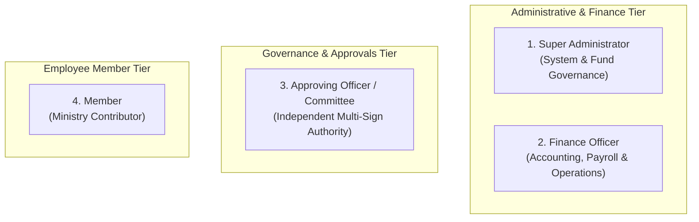
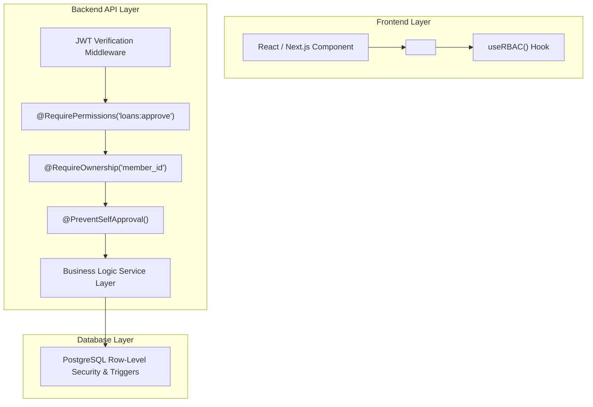

# Role-Based Access Control (RBAC) & Governance Specification
## Ministry Cooperative Contributory Fund Platform

---

## 1. Executive Summary & Security Philosophy

The **Ministry Cooperative Contributory Fund Management System** implements a zero-trust, multi-layered Role-Based Access Control (RBAC) architecture combined with **Attribute-Based / Ownership Access Control (ABAC)** and **Maker-Checker Governance (Dual-Control)**.

### Core Principles
1. **Principle of Least Privilege (PoLP)**: Users operate with only the minimum privileges required to perform their organizational functions.
2. **Strict Member Data Isolation**: Members can strictly view and mutate only their own financial and profile records. Cross-member data enumeration or access is rejected at both the API gateway, controller middleware, and database row-level security (RLS) layers.
3. **Maker-Checker Dual Control**: A Finance Officer or Administrator who initiates/stages a financial transaction (e.g. loan application, disbursement, payroll variance adjustment) is strictly barred from approving that transaction.
4. **Immutable Audit Governance**: Every committee approval or rejection records an immutable audit log containing the Approver identity, Date, Time (UTC & Local), Decision (`APPROVED` or `REJECTED`), and mandatory justification comment.
5. **No Destructive Financial Deletions**: Financial transactions and ledger entries can never be permanently deleted from the database. Reversals must be executed via balanced, committee-approved adjusting journal entries.

---

## 2. Defined System Roles



---

## 3. Comprehensive Permissions Matrix

| Granular Permission Code | Permission Description | Super Admin | Finance Officer | Approving Officer | Member |
| :--- | :--- | :---: | :---: | :---: | :---: |
| **USER & SYSTEM MANAGEMENT** | | | | | |
| `users:create` | Create administrative, finance & committee users | ✅ | ❌ | ❌ | ❌ |
| `users:read` | View user accounts and system roles | ✅ | ❌ | ❌ | ❌ |
| `users:update` | Edit user credentials, roles, and status | ✅ | ❌ | ❌ | ❌ |
| `users:delete` | Deactivate/suspend system accounts | ✅ | ❌ | ❌ | ❌ |
| `system:config` | Configure contribution rules, grades & loan settings | ✅ | ❌ | ❌ | ❌ |
| `system:security` | Manage backups, security policies, and permissions | ✅ | ❌ | ❌ | ❌ |
| `audit:view` | Inspect comprehensive system audit logs & traces | ✅ | ❌ | ❌ | ❌ |
| **MEMBER MANAGEMENT** | | | | | |
| `members:create` | Register new ministry members into the cooperative | ✅ | ✅ | ❌ | ❌ |
| `members:read_all` | View list and directory of all ministry members | ✅ | ✅ | ✅ | ❌ |
| `members:read_self` | View own member profile, grade, bank & next-of-kin | ✅ | ✅ | ✅ | ✅ |
| `members:update_self` | Request update to own next-of-kin or phone number | ❌ | ❌ | ❌ | ✅ |
| `departments:manage` | Create, edit, and organize ministry departments | ✅ | ❌ | ❌ | ❌ |
| `contribution_rules:manage` | Configure salary/grade-level contribution brackets | ✅ | ❌ | ❌ | ❌ |
| **PAYROLL & CONTRIBUTIONS** | | | | | |
| `payroll:import` | Upload monthly electronic payroll files (Excel/CSV) | ❌ | ✅ | ❌ | ❌ |
| `payroll:reconcile` | Run variance matching and resolve discrepancy flags | ❌ | ✅ | ❌ | ❌ |
| `payroll:post` | Commit reconciled payroll deductions to core ledger | ❌ | ✅ | ❌ | ❌ |
| `contributions:view_all` | View all contribution schedules across the fund | ✅ | ✅ | ✅ | ❌ |
| `contributions:view_self` | View personal monthly savings ledger and history | ❌ | ❌ | ❌ | ✅ |
| `manual_payment:submit` | Submit missed-contribution receipt & bank transfer ref | ❌ | ❌ | ❌ | ✅ |
| `manual_payment:verify` | Verify member bank payment receipts & credit ledger | ❌ | ✅ | ❌ | ❌ |
| **LOAN MANAGEMENT** | | | | | |
| `loans:apply` | Apply for Salary Advance or Emergency Loan | ❌ | ❌ | ❌ | ✅ |
| `loans:view_self` | View personal active loans, schedule & balance | ❌ | ❌ | ❌ | ✅ |
| `loans:view_all` | View fund loan portfolio, aging, and schedules | ✅ | ✅ | ✅ | ❌ |
| `loans:review` | Inspect loan application supporting documents & savings | ❌ | ❌ | ✅ | ❌ |
| `loans:approve` | Approve or Reject loan application with audit log | ❌ | ❌ | ✅ | ❌ |
| `loans:disburse` | Record bank payout reference and mark as disbursed | ❌ | ✅ | ❌ | ❌ |
| `loans:repay_manage` | Manage payroll repayment deductions and manual payoffs | ❌ | ✅ | ❌ | ❌ |
| **WITHDRAWALS & EXIT** | | | | | |
| `withdrawals:request` | Submit savings withdrawal or membership exit request | ❌ | ❌ | ❌ | ✅ |
| `withdrawals:view_self` | View personal withdrawal status and disbursement details | ❌ | ❌ | ❌ | ✅ |
| `withdrawals:prepare` | Calculate clearance & net payout (net of active loans) | ❌ | ✅ | ❌ | ❌ |
| `withdrawals:approve` | Approve or Reject withdrawal request with comments | ❌ | ❌ | ✅ | ❌ |
| **FINANCIAL REPORTING & LEDGER** | | | | | |
| `reports:view_all` | Generate fund balance sheets, liquidity & audit reports | ✅ | ✅ | ❌ | ❌ |
| `reports:view_self` | Download personal contribution & loan PDF statements | ❌ | ❌ | ❌ | ✅ |
| `ledger:view_all` | View double-entry journal transactions and cash books | ✅ | ✅ | ❌ | ❌ |

---

## 4. Hard Constraints & Negative Authorization Rules

To prevent financial fraud, the platform enforces hard negative constraints:

### 1. Finance Officer Restrictions
* **No Permission Escalation**: Cannot modify role assignments, access tokens, or permissions (`CANNOT users:update_roles`).
* **No Permanent Ledger Deletions**: Direct SQL `DELETE` is permanently blocked on `ledger_entries`, `journal_entries`, `loans`, and `contributions` tables.
* **No Self-Approval (Maker-Checker)**: A Finance Officer who submits an application for their own loan or withdrawal cannot review, approve, or disburse that transaction.

### 2. Member Isolation Boundaries
* **Strict Tenant Scoping**: Every API request made by a `MEMBER` automatically injects `WHERE member_id = req.user.member_id` at the database query level.
* **Forbidden Resource Access**: Members cannot query the `members:read_all`, `payroll:*`, `reports:view_all`, or `ledger:*` endpoints under any circumstances.

---

## 5. Committee Approval Audit Specification

Every committee decision must record the following mandatory audit payload:

```json
{
  "approval_id": "8f3b2e91-4d7a-4a81-9b93-8d9e2b10a112",
  "entity_type": "LOAN_APPLICATION",
  "entity_id": "c19b48f0-32a1-432d-8b01-e28a9b3f4e90",
  "approver": {
    "user_id": "99a0b123-f321-4fca-89a1-77b3c21a4455",
    "name": "Dr. Sarah Aliyu",
    "role": "APPROVING_OFFICER",
    "staff_id": "MIN-COMM-04"
  },
  "timestamp": {
    "utc": "2026-08-14T18:25:00.000Z",
    "date": "2026-08-14",
    "time": "19:25:00 WAT"
  },
  "decision": "APPROVED",
  "comment": "Verified against 18 months continuous contribution. Maximum loan ceiling of ₦850,000 is within member accumulated savings of ₦1,200,000.",
  "security_metadata": {
    "ip_address": "192.168.10.45",
    "user_agent": "Mozilla/5.0 (Windows NT 10.0; Win64; x64) AppleWebKit/537.36",
    "digital_signature_hash": "e3b0c44298fc1c149afbf4c8996fb92427ae41e4649b934ca495991b7852b855"
  }
}
```

---

## 6. Frontend & Backend Implementation Architecture


